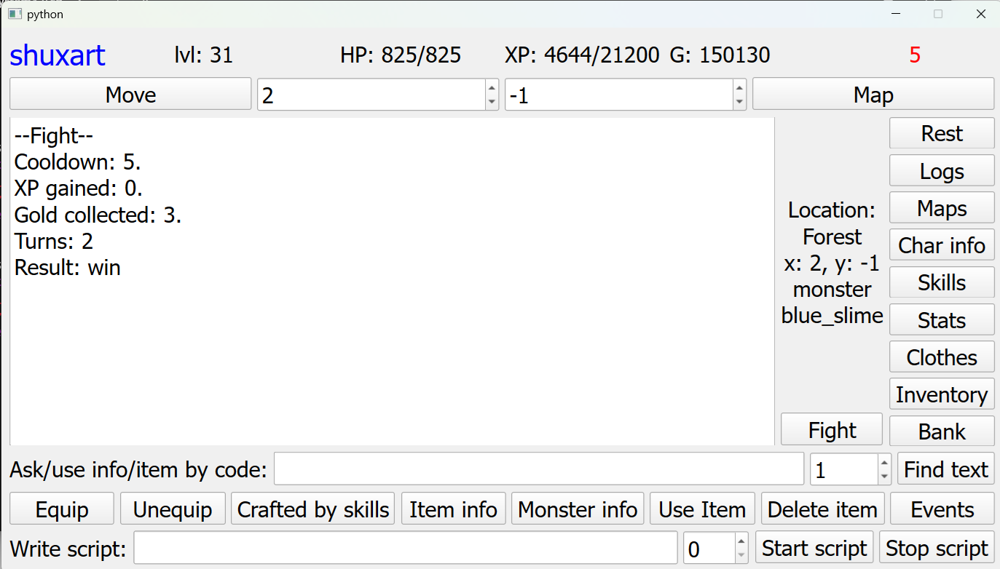
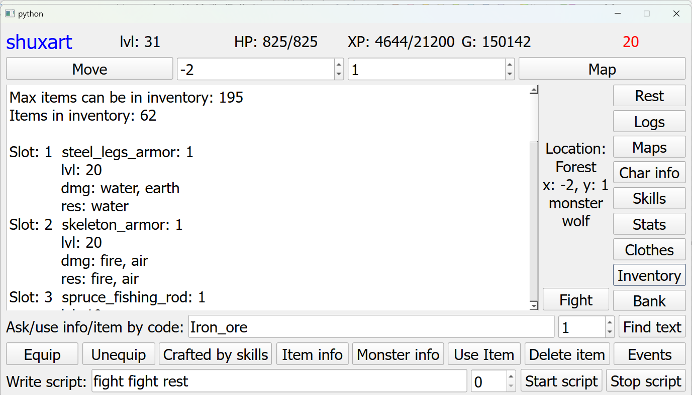
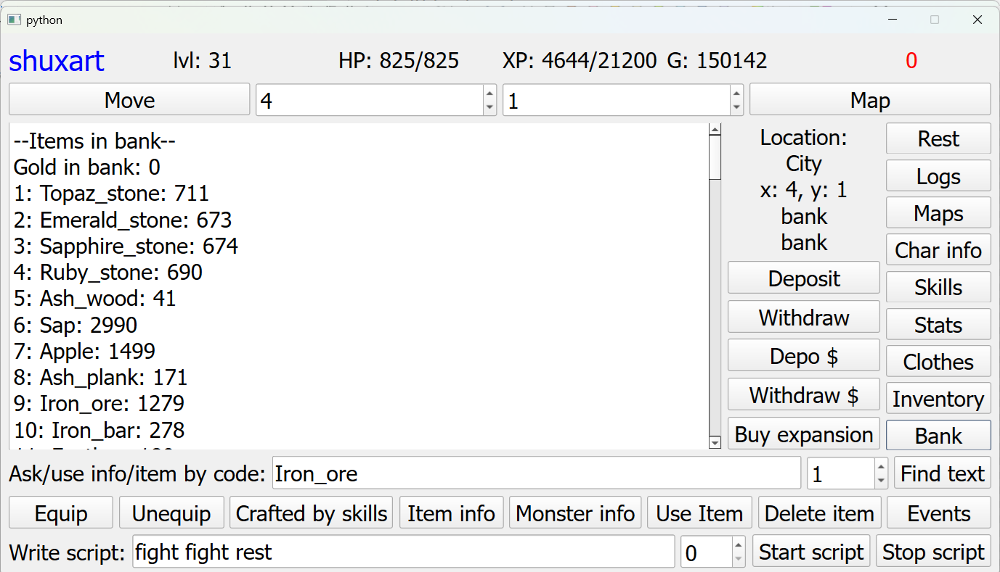
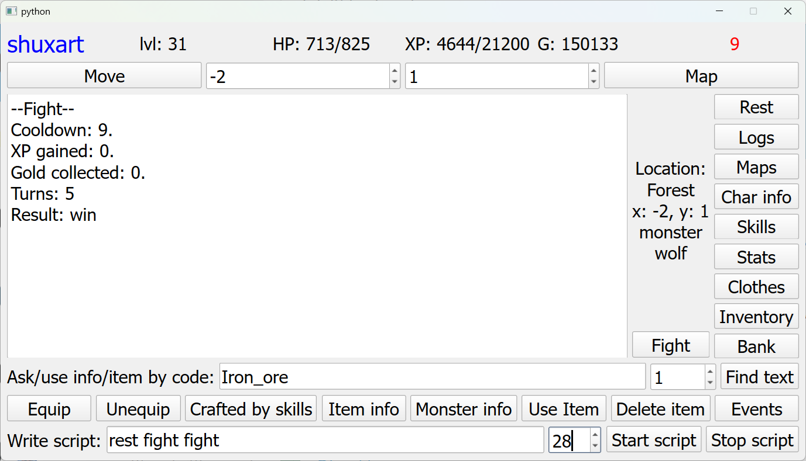
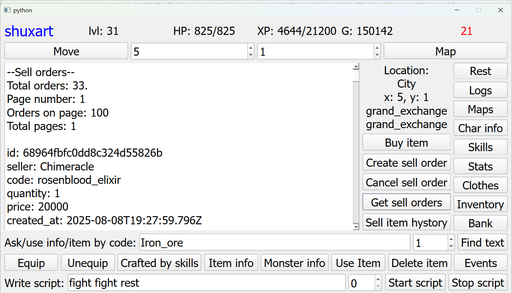

MMO Artifacts Client
====================

A desktop client for [Artifacts MMO](https://artifactsmmo.com/) built with **Python**, **PySide6** for GUI, and the official **Artifacts MMO API** for real-time game interaction.

Features
--------

*   **Full API integration** with Artifacts MMO:
    
    *   Character stats, skills, inventory, bank, tasks, events
        
    *   Actions: move, fight, gather, craft, trade, recycle, use items
        
    *   Bank and gold deposit/withdraw
        
    *   Grand Exchange buy/sell operations
        
*   **Interactive GUI** built with PySide6
    
    *   Dynamic location-based action buttons
        
    *   Real-time cooldown timer
        
    *   Scripted action execution (automation)
        
*   **JSON data handling**
    
    *   Items, monsters, bank data loaded from local JSON for fast access
        
*   **Error handling** for API requests
    

Technologies Used
-----------------

*   Python 3.x
    
*   PySide6 – GUI
    
*   Requests – HTTP requests
    
*   JSON – data storage and parsing
    
*   Object-Oriented Programming (OOP)
    
*   Threading via QThreadPool for cooldown timers
    

Installation & Setup
--------------------

1.  bashCopyEditgit clone https://github.com//artifacts-client.gitcd artifacts-client
    
2.  bashCopyEditpip install -r requirements.txt
    
3.  bashCopyEditexport ARTIFACTS\_TOKEN="your\_token\_here" # Linux/macOSsetx ARTIFACTS\_TOKEN "your\_token\_here" # Windows
    
4.  Create a character in the game and update CHAR\_NAME in main.py with your character’s name.
    

Usage
-----

*   bashCopyEditpython main.py
    
*   Use the GUI to:
    
    *   Move around the map
        
    *   Fight monsters
        
    *   Gather resources
        
    *   Craft and trade items
        
    *   View inventory, stats, and tasks
        
    *   Automate actions with the scripting tool
        

Example script:

Plain textANTLR4BashCC#CSSCoffeeScriptCMakeDartDjangoDockerEJSErlangGitGoGraphQLGroovyHTMLJavaJavaScriptJSONJSXKotlinLaTeXLessLuaMakefileMarkdownMATLABMarkupObjective-CPerlPHPPowerShell.propertiesProtocol BuffersPythonRRubySass (Sass)Sass (Scss)SchemeSQLShellSwiftSVGTSXTypeScriptWebAssemblyYAMLXML`   nginxCopyEditgathering 50   `

Runs the "Gathering" action 50 times.Or chain actions:

Plain textANTLR4BashCC#CSSCoffeeScriptCMakeDartDjangoDockerEJSErlangGitGoGraphQLGroovyHTMLJavaJavaScriptJSONJSXKotlinLaTeXLessLuaMakefileMarkdownMATLABMarkupObjective-CPerlPHPPowerShell.propertiesProtocol BuffersPythonRRubySass (Sass)Sass (Scss)SchemeSQLShellSwiftSVGTSXTypeScriptWebAssemblyYAMLXML`   cssCopyEditfight fight rest 10   `

Repeats the sequence _fight → fight → rest_ 10 times.

Screenshots
-----------

